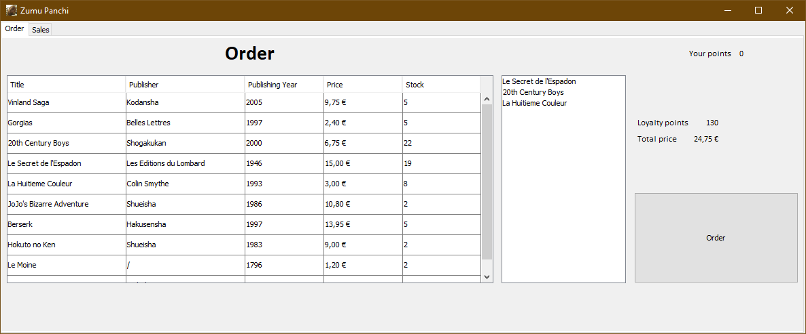

# Zumu-Panchi

Simple Java/Swing application for managing a bookshop.

# Docs

The documentation is available [here](https://poulpy.github.io/Zumu-Panchi/).

To generate the docs : 

	ant javadoc
	
	
# Binary

The executable jar is available under dist/.
To generate the jar run :

	ant create_run_jar
	# then run
	java -jar dist/zumu_panchi.jar

## Manual

The table on the left shows the books available in the bookshop.

To add a book to your cart, click on it.
To remove a book from your cart, click on the item on the list to the right.
The loyalty points and the total price of the cart are shown to the far right.

To pass an order, click on the order button.
The total of loyalty points are shown in the upper right corner.

If the user's points reached a threshold, a book is given for free to the customer.
The threshold is currently **500** (and not 1000). 

By default, you are in the order tab. The sales tab shows all sales of the bookshop.

### Author

Paul Repain

